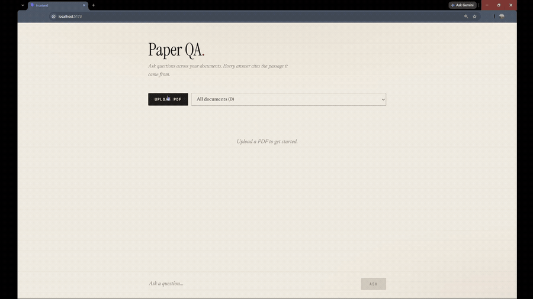
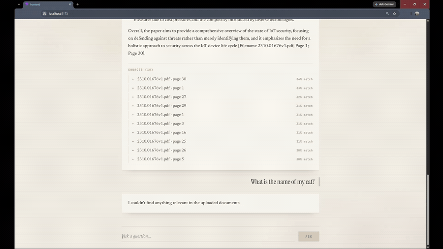

# Paper QA

Ask questions about your PDFs and get answers grounded in the source, with a citation to the exact page behind every claim.

**Motivation:** Background research means reading a lot of papers, then trying to find one specific thing in them again a week later. Having been through a dissertation, I know most of it is hunting for something you know you read somewhere. I built this so the students doing it next spend less time searching and more time reading.

### At a glance

|  |  |
|---|---|
| **What** | Upload PDFs, ask questions, get answers with the source passage attached |
| **Stack** | Python, FastAPI, PostgreSQL with pgvector, React, Docker |
| **Retrieval** | Chunking, embeddings and vector search, not prompt stuffing |
| **Citations** | Verified against the database before display, so invented pages never appear |
| **Two strategies** | Top-k search for normal questions, map-reduce over the whole document for "summarise everything" |
| **Measured** | 40 case eval set: 97% retrieval recall@5, 90% correct refusals |
| **Honest bit** | The first eval scored 100%, which meant the eval was broken, not the system. [Why](#reading-these-numbers-honestly) |

### Answering, with the source behind it



A 37 page paper is uploaded and indexed, a question is asked, and the cited source is opened underneath the answer. The highlighted sentence is the one the answer quotes.

### Declining, when the answer isn't there



Two safeguards, both visible here.

*"What is the name of my cat?"* returns nothing. The closest passage scored below the similarity threshold, so the question never reached the model.

*"Which IoT vendors were found most vulnerable in the authors' testing?"* is harder. It retrieves ten genuinely relevant passages at 52-56% similarity, scoring as highly as questions the system answers confidently, and still declines: the paper is a survey and ran no vendor testing. Relevant context is not the same as an answer, and this is built to tell the difference.

---

## Why this isn't a ChatGPT wrapper

The naive version is one prompt: paste the document, ask the question. That breaks immediately. Papers don't fit in a context window, cost scales with every question, and nothing constrains the model from inventing things.

- **Real retrieval.** Documents are chunked, embedded, and stored in Postgres with pgvector. Questions retrieve the closest passages.
- **Citations verified, not generated.** Every cited page is checked against the database before display. Invented page numbers never reach the screen.
- **Two retrieval strategies.** Top-k search cannot answer "summarise everything covered". I measured that failing and built a map-reduce path for it.
- **A real evaluation set.** 40 cases with a hand-verified answer key, scoring retrieval and refusal separately.

---

## How it works

**On upload:** extract text per page with `pypdf`, strip the bibliography, chunk into ~500 words with 50-word overlap keeping page numbers, embed each chunk (`text-embedding-3-small`, batched), store in Postgres.

**On a question**, routed to one of two paths:

| | Normal | Exhaustive |
|---|---|---|
| Trigger | anything else | "list all", "summarise this document", "main points" |
| Method | top-k vector search | map-reduce over every chunk |
| API calls | 2 | ~14 |
| Latency | < 1s | ~6s |

The **normal path** embeds the question, retrieves the closest chunks above a similarity floor, and answers from those with page citations.

The **exhaustive path** reads the whole document in concurrent batches of 20, extracts question-relevant points from each, discards batches that found nothing, and combines the rest.

---

## Evaluation

Retrieval and generation are scored separately, deliberately. When an answer is wrong you need to know whether the retriever missed the passage or the model misread it, and grading the final text alone cannot tell you which.

**Retrieval: did the correct page appear in the top k?**

| | recall@5 |
|---|---|
| Overall | 29/30 (97%) |
| easy | 7/7 (100%) |
| medium | 7/7 (100%) |
| hard | 15/16 (94%) |
| source-worded | 18/18 (100%) |
| paraphrased | 11/12 (92%) |

**Refusals: does it decline questions the document can't answer?** 9/10 (90%)

### Reading these numbers honestly

**My first eval scored 100% on everything.** That meant the eval was too easy, not that the system was perfect. k=5 and k=20 gave identical results, so the harness couldn't distinguish between configurations, which is its entire job.

Two causes. The questions used the paper's own vocabulary, so keyword overlap alone could carry them, and the answer key was built by term-matching, which correlates with what the retriever does. So I added 15 questions phrased the way someone who hadn't read the paper would ask, such as *"On a patchy wireless link where packets go missing, how do they get the data back?"* for network coding, and split the results by phrasing style. The `source-worded` versus `paraphrased` gap is what that measures.

**These numbers are still flattering.** The corpus is one paper of ~60 chunks, so retrieval never has to choose between documents. Five papers on adjacent topics would push the scores down, and that's the obvious next test.

---

## What it can't do

**Meta-questions.** *"Did anyone put a number on how much these defences help?"* was the single retrieval miss. Embeddings capture what text is *about*, so a question about a property such as "contains a statistic" has no topical anchor and drifts. It scored 0.30, below the threshold, so it refused rather than answering from the wrong pages. A safe failure.

**Exhaustive queries are approximate.** Map-reduce reads everything, but the reduce step compresses. One run dropped the Software Defined Networks section entirely. Much better than top-k here, not perfect.

**Related-work attribution.** A chunk in isolation doesn't say "this is a summary of someone else's paper", so a cited work's finding is occasionally presented as the document's own. The prompt mitigates it. Storing section headings per chunk would fix it properly.

**Literal-term questions.** *"Which pages mention ENISA?"* reports which of the *retrieved* pages mention it, framed as a fact about the whole document. Hybrid search, SQL full-text alongside vector search, is the standard fix.

**One refusal failure.** *"Which of these defences should I use for my smart doorbell?"* got an answer. Arguably synthesis rather than hallucination, since it applied real techniques to a scenario the paper doesn't cover. I scored it as a failure rather than relabelling it: the distinction is genuinely ambiguous, and a 90% I can explain beats a 100% I redefined my way into.

---

## Decisions and trade-offs

**Chunk size 500 words, 50-word overlap.** Small enough that an embedding represents one idea rather than averaging three, with overlap so a sentence spanning a boundary survives in both halves. Chunks shorter than the overlap are dropped: they were near-duplicates of the previous chunk's tail, crowding out real content.

**pgvector over a dedicated vector database.** One database for documents and vectors, no extra service, and joins to metadata come free. At millions of chunks a specialised store would win. At this scale it's needless complexity.

**No ANN index yet.** pgvector's approximate indexes need existing data to build well, and at a few hundred chunks an exact scan beats the approximation. Worth adding after measuring, not before.

**The bibliography is stripped before indexing.** A reference list is a dense set of paper titles, and the model mistook those titles for the document's own findings, producing correctly-cited claims that were really just names of other papers. *Correct citation, wrong content* is nastier than an obvious hallucination because it survives a spot check. Stripping also cut ~20% of chunks, reducing cost and noise.

**`temperature=0` everywhere.** Map-reduce makes 14 model calls, each sampling independently at the default temperature, so the same question gave visibly different answers between runs. That makes eval scores meaningless: you can't separate an improvement from a lucky roll.

**Regex intent routing, not an LLM classifier.** A classifier would generalise better but costs a round trip per question and can itself be wrong. Regex is free, transparent, and a false negative degrades to normal retrieval, which still answers reasonably.

**A forgiving answer prompt.** Early versions refused too often, including on legitimate broad questions. Loosening it fixed that and directly caused the refusal failure above. The trade-off is visible in the numbers rather than hidden.

---

## Running it

**Requirements:** Python 3.11+, Node 18+, Docker, an OpenAI API key.

```bash
git clone https://github.com/Sparrow0009/paper_qa.git
cd paper_qa
```

**1. Database** (from the project root)

```bash
docker compose up -d
```

Load the schema. PowerShell:

```powershell
Get-Content backend/schema.sql | docker exec -i paper_qa-db psql -U postgres -d paperqa
```

macOS/Linux:

```bash
docker exec -i paper_qa-db psql -U postgres -d paperqa < backend/schema.sql
```

The container is named `paper_qa-db`, set explicitly in `docker-compose.yml`.

**2. Backend**

```bash
cd backend

python -m venv venv
venv\Scripts\activate        # Windows
source venv/bin/activate     # macOS/Linux

pip install -r requirements.txt
cp .env.example .env         # then add your OpenAI key
uvicorn main:app --reload
```

API docs at http://localhost:8000/docs

**3. Frontend** (in a second terminal, from the project root)

```bash
cd frontend
npm install
npm run dev
```

App at http://localhost:5173

**4. Evaluation** (optional, from `backend/`)

```bash
python fill_pages.py your-paper.pdf   # suggests pages for the answer key
python eval.py --skip-refusals        # retrieval only, no API calls
python eval.py                        # full run
```

---

## Project structure

```
backend/
  main.py          FastAPI endpoints
  chunking.py      Text splitting and reference stripping
  embeddings.py    OpenAI embeddings, batched
  db.py            Database connection
  store.py         All SQL: save, search, delete, fetch all
  answer.py        Retrieval path and intent routing
  overview.py      Map-reduce path for exhaustive questions
  eval.py          Evaluation harness
  fill_pages.py    Helper for building the answer key
  eval_set.json    40 test cases
  schema.sql       Table definitions
frontend/          React UI
docs/              Demo recordings
docker-compose.yml Postgres with pgvector
```

A plain-English walkthrough of every function is in [CODE_GUIDE.md](CODE_GUIDE.md).

---

## Built with

FastAPI, PostgreSQL with pgvector, OpenAI embeddings and `gpt-4o-mini`, React with Vite, Docker
